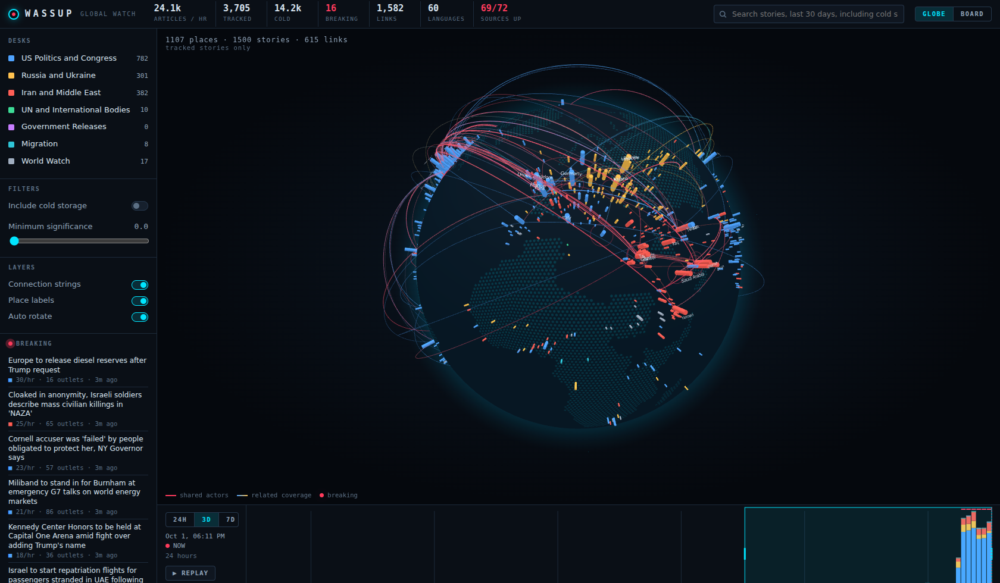
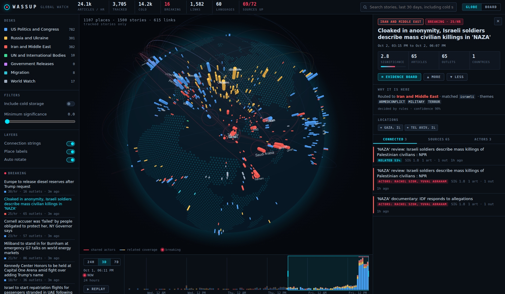
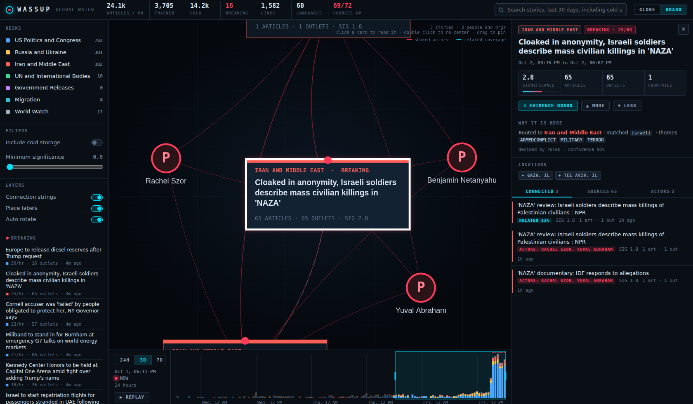

# Wassup

A global news intelligence system. Wassup collects news from around the world, filters it against your interests, groups articles into stories, links stories that push and pull on each other, and shows it all on an interactive globe and evidence board. In Phase 1 a newsroom of AI agents, run by [Paperclip](https://github.com/paperclipai/paperclip), takes over the research.



## What Phase 0 does

- **Collects** continuously, with no AI involved: GDELT (English plus a translingual feed covering 65 languages, every 15 minutes), 67 RSS feeds from outlets in 24 countries and 7 languages, Congress.gov bills, Senate roll call votes, and the Federal Register.
- **Groups** articles into stories with local multilingual embeddings (bge-m3 through Ollama), so the Farsi, Russian and English coverage of one event becomes one story.
- **Places** every story on the map using GDELT's geotags and a bundled gazetteer of 250 countries and 2,500 cities.
- **Triages** each story (not each article) into one of seven desks or cold storage. Rules decide most stories for free; a local LLM gives a second opinion only when the rules are unsure. Sports, celebrity and lifestyle news goes to cold storage unless it ties into a bigger story.
- **Rates sources**: primary and wire, independent, partisan, unrated, and state media. State media is always flagged and never picked as a headline when anyone else covers the story.
- **Links** stories that share uncommon people or organizations, or that cover related ground, and flags **breaking** stories by how fast coverage is accelerating.
- **Learns** from your thumbs up and down.

| Story panel | Evidence board |
| --- | --- |
|  |  |

## Quick start (Windows 11)

Full instructions, including WSL2, Docker Desktop and Ollama setup, are in [docs/RUNNING.md](docs/RUNNING.md). Short version, inside WSL2 Ubuntu:

```bash
ollama pull bge-m3 && ollama pull qwen3:8b      # in Windows PowerShell
git clone https://github.com/Unite-Ideas/wassup.git && cd wassup
cp .env.example .env
docker compose up -d --build
```

Then open http://localhost:8000.

## Using the dashboard

- **Globe**: each column is a place, colored by its busiest desk and sized by how many stories mention it. Pulsing red rings are breaking stories. Red strings are stories that share actors; colored strings are related coverage. Click a place to see everything from there. Hover a string to see why it exists, click it to jump along it.
- **Story panel**: why the story was routed (or put in cold storage), every source with its trust tier and language, the connected stories, and the people and organizations involved. MORE and LESS train your interest profile.
- **Evidence board**: pins a story to the wall with every connected story and the people and organizations that tie them together. Double click a card to re-center on it. Drag cards to pin them.
- **Timeline**: drag the highlighted window to look at any slice of time, drag its edges to resize it, or press REPLAY to watch the picture build up.
- **Left rail**: toggle desks (ctrl or alt click to show one desk only), include cold storage, set a minimum significance, and jump to breaking or top stories.

## Layout

```
config/      desks, interests, sources and outlet tiers (edit these)
db/          Postgres schema (pgvector + PostGIS)
pipeline/    Python: collectors, clustering, triage, linking, API, CLI, tests
ui/          React + globe.gl + force-graph dashboard
docs/        architecture, running guide, screenshots
```

See [docs/ARCHITECTURE.md](docs/ARCHITECTURE.md) for the design and the roadmap.
